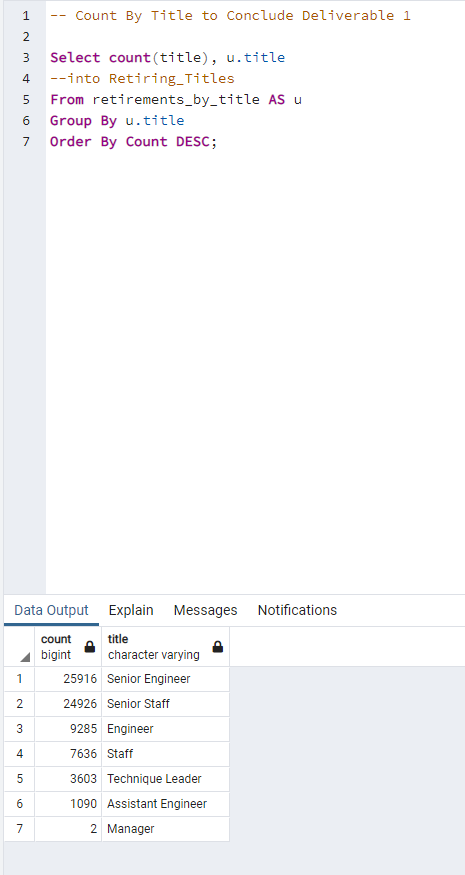
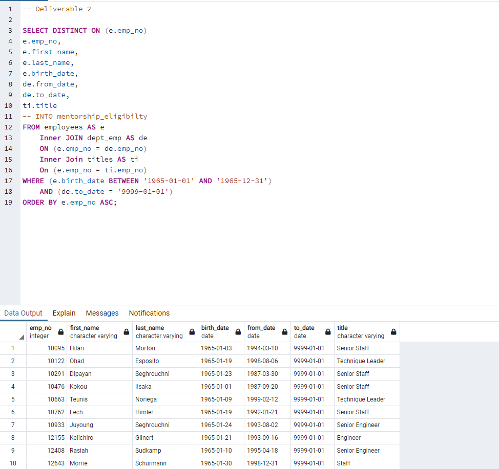

# Pewlett-Hackard-Analysis Retirement Analysis

## Overview
The purpose of this analysis was two-fold.  To allow managment to plan headcount and recruiting initiatives, our "mock" data science team was asked to deliver counts of retirees by title.  Secondly, managmnent requested a list of all employees, who qualify for the firm's mentorship program.  For this analysis we used postgres SQL to generate our database and preform queries.

## Results
- **Deliverable 1 - By title, how many employees are retiring?**
  - To answer the first "mock" question from management 3 tables were created through a serios of joins, DISTINCT ON, and INTO statments.  This logic was used to address non-normal data with duplicate feilds.
  - Once created with the below code, our final query identifies that Senior Engineers and Staff will have the largest propotion of retirments in the comming years.  This is important, as these two roles are high salary and recruitment activities come with high cost and delays due to a limited talent/competative pool. HR can now utilize this data for recruitment planning. The below code represents the final query please see challenge file for the complete code.
###

- **Deliverable 2 - Which employees are eligible for our Mentorship Program**
  - For the second deliverable we were tasked with identifying employess eligible for mentorship.  This list was based on birthdate and start date.
  - Using the same tables created in the first deliverable, we used a series of joins to draft the final report.  From the results, 1236 emplyees are eligible for mentorship.
###

## Summary
Final questions from managent where: 1) How many roles will need to be filled as the "silver tsunami" begins to make an impact? 2) Are there enough qualified, retirement-ready employees in the departments to mentor the next generation of Pewlett Hackard employees?

- **How many roles will need to be filled as the "silver tsunami" begins to make an impact?**
  - If the firm is planning for a 100% replacement rate for retiring employees, the firm will need to hire 72,458 works in the coming years
- **Are there enough qualified, retirement-ready employees in the departments to mentor the next generation of Pewlett Hackard employees?**
  - The answer is yes, as the current eligible mentee pool is 1236 employees. Additional analysis could be done by department, to answer this question with more detail. 
